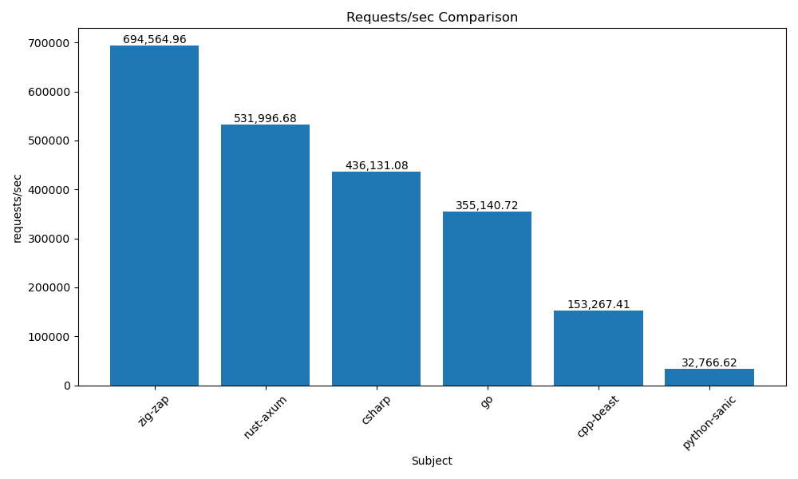
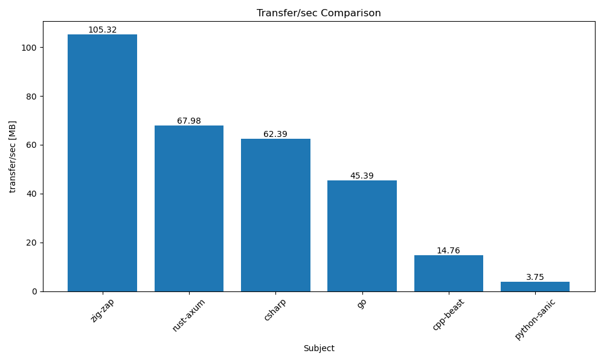

# ⚡zap⚡ - blazingly fast backends in zig

 [](https://discord.gg/jQAAN6Ubyj)

Zap is intended to become the [zig](https://ziglang.org) replacement for the
kind of REST APIs I used to write in [python](https://python.org) with
[Flask](https://flask.palletsprojects.com) and
[mongodb](https://www.mongodb.com), etc. It can be considered to be a
microframework for web applications.

What I needed for that was a blazingly fast, robust HTTP server that I could use
with zig. While facil.io supports TLS, I don't care about HTTPS support. In
production, I use [nginx](https://www.nginx.com) as a reverse proxy anyway.

Zap wraps and patches [facil.io - the C web application
framework](https://facil.io).


**⚡ZAP⚡ IS SUPER ALPHA**

_Under the hood, everything is super robust and fast. My zig wrappers are fresh,
juicy, and alpha._

After having used ZAP in production for weeks, I can confidently assert hat it
proved to be:

- ⚡ **blazingly fast** ⚡
- 💪 **extremely robust** 💪

Exactly the goals I set out to achieve!

Here's what works:

- **Super easy build process**: zap's `build.zig` now uses the up-and-coming zig
  package manager for its C-dependencies, no git submodules anymore.
  - _tested on Linux and macOS (arm, M1)_
- **[hello](examples/hello/hello.zig)**: welcomes you with some static HTML
- **[routes](examples/routes/routes.zig)**: a super easy example dispatching on
  the HTTP path
- **[serve](examples/serve/serve.zig)**: the traditional static web server with
  optional dynamic request handling
- **[sendfile](examples/sendfile/sendfile.zig)**: simple example of how to send
  a file, honoring compression headers, etc.
- **[hello_json](examples/hello_json/hello_json.zig)**: serves you json
  dependent on HTTP path
- **[endpoint](examples/endpoint/)**: a simple JSON REST API example featuring a
  `/users` endpoint for performing PUT/DELETE/GET/POST operations and listing
  users, together with a simple frontend to play with. **It also introduces a
  `/stop` endpoint** that shuts down Zap, so **memory leak detection** can be
  performed in main().
- **[mustache](examples/mustache/mustache.zig)**: a simple example using
  [mustache](https://mustache.github.io/) templating.
- **[endpoint authentication](examples/endpoint_auth/endpoint_auth.zig)**: a
  simple authenticated endpoint. Read more about authentication
  [here](./doc/authentication.md).
- **[http parameters](examples/http_params/http_params.zig)**: a simple example
  sending itself query parameters of all supported types.
- **[cookies](examples/cookies/cookies.zig)**: a simple example sending itself a
  cookie and responding with a session cookie.
- **[websockets](examples/websockets/)**: a simple websockets chat for the
  browser.
- **[Username/Password Session
  Authentication](./examples/userpass_session_auth/)**: A convenience
  authenticator that redirects un-authenticated requests to a login page and
  sends cookies containing session tokens based on username/password pairs
  received via POST request.
- **[MIDDLEWARE support](examples/middleware/middleware.zig)**: chain together
  request handlers in middleware style. Provide custom context structs, totally
  type-safe, using **[ZIG-CEPTION](doc/zig-ception.md)**. If you come from GO
  this might appeal to you.
- **[MIDDLEWARE with endpoint
  support](examples/middleware_with_endpoint/middleware_with_endpoint.zig)**:
  Same as the example above, but this time we use an endpoint at the end of the
  chain, by wrapping it via `zap.Middleware.EndpointHandler`. Mixing endpoints
  in your middleware chain allows for usage of Zap's authenticated endpoints and
  your custom endpoints. Since Endpoints use a simpler API, you have to use
  `r.setUserContext()` and `r.getUserContext()` with the request if you want to
  access the middleware context from a wrapped endpoint. Since this mechanism
  uses an `*anyopaque` pointer underneath (to not break the Endpoint API), it is
  less type-safe than `zap.Middleware`'s use of contexts.
- [**Per Request Contexts**](./src/zap.zig#L102) : With the introduction of
  `setUserContext()` and `getUserContext()`, you can, of course use those two in
  projects that don't use `zap.SimpleEndpoint` or `zap.Middleware`, too, if you
  really, really, absolutely don't find another way to solve your context
  problem. **We recommend using a `zap.SimpleEndpoint`** inside of a struct that
  can provide all the context you need **instead**. You get access to your
  struct in the callbacks via the `@fieldParentPtr()` trick that is used
  extensively in Zap's examples, like the [endpoint
  example](examples/endpoint/endpoint.zig).
- [**Error Trace Responses**](./examples/senderror/senderror.zig): You can now
  call `r.sendError(err, status_code)` when you catch an error and a stack trace
  will be returned to the client / browser.

I'll continue wrapping more of facil.io's functionality and adding stuff to zap
to a point where I can use it as the JSON REST API backend for real research
projects, serving thousands of concurrent clients.


## ⚡blazingly fast⚡

Claiming to be blazingly fast is the new black. At least, zap doesn't slow you
down and if your server performs poorly, it's probably not exactly zap's fault.
Zap relies on the [facil.io](https://facil.io) framework and so it can't really
claim any performance fame for itself. In this initial implementation of zap,
I didn't care about optimizations at all.

But, how fast is it? Being blazingly fast is relative. When compared with a
simple GO HTTP server, a simple zig zap HTTP server performed really good on my
machine (x86_64-linux):

- zig zap was nearly 30% faster than GO
- zig zap had over 50% more throughput than GO

**Update**: Thanks to @felipetrz, I got to test against more realistic Python
and Rust examples. Both python `sanic` and rust `axum` were easy enough to
integrate.

**Update**: I have automated the benchmarks. See
[blazingly-fast.md](./blazingly-fast.md) for more information. Also, thanks to
@alexpyattaev, the benchmarks are fairer now, pinning server and client to
specific CPU cores.

**Update**: I have consolidated the benchmarks to one good representative per
language. See more details in [blazingly-fast.md](./blazingly-fast.md). It
contains rust implementations that come pretty close to zap's performance in the
simplistic testing scenario.






So, being somewhere in the ballpark of basic GO performance, zig zap seems to be
... of reasonable performance 😎. 

I can rest my case that developing ZAP was a good idea because it's faster than
both alternatives: a) staying with Python, and b) creating a GO + Zig hybrid.

See more details in [blazingly-fast.md](blazingly-fast.md).

## 💪 Robust

ZAP is **very robust**. In fact, it is so robust that I was confidently able to
only work with in-memory data (RAM) in all my initial ZAP projects so far: 3
online research experiments. No database, no file persistence, until I hit
"save" at the end 😊.

So I was able to postpone my cunning data persistence strategy that's similar to
a mark-and-sweep garbage collector and would only persist "dirty" data when
traffic is low, in favor of getting stuff online more quickly. But even if
implemented, such a persistence strategy is risky because when traffic is not
low, it means the system is under (heavy) load. Would you confidently NOT save
data when load is high and the data changes most frequently -> the potential
data loss is maximized?

To answer that question, I just skipped it. I skipped saving data until
receiving a "save" signal. And it worked. ZAP kept on zapping. When
traffic calmed down or all experiment participants had finished, I hit "save"
and went on analyzing the data.

Handling all errors does pay off after all. No hidden control flow, no hidden
errors or exceptions is one of Zig's strengths.

To be honest: There are still pitfalls. E.g. if you request large stack sizes
for worker threads, Zig won't like that and panic. So make sure you don't have
local variables that require tens of megabytes of stack space.


### 🛡️ Memory-safe

See the [StopEndpoint](examples/endpoint/stopendpoint.zig) in the
[endpoint](examples/endpoint) example. That example uses ZIG's awesome
`GeneralPurposeAllocator` to report memory leaks when ZAP is shut down. The
`StopEndpoint` just stops ZAP when receiving a request on the `/stop` route.

You can use the same strategy in your debug builds and tests to check if your
code leaks memory.


## Getting started

Make sure you have **the latest zig release (0.11.0)** installed. Fetch it from
[here](https://ziglang.org/download).

```shell
$ git clone https://github.com/zigzap/zap.git
$ cd zap
$ zig build run-hello
$ # open http://localhost:3000 in your browser
```

... and open [http://localhost:3000](http://localhost:3000) in your browser.

## Using ⚡zap⚡ in your own projects

Make sure you have **the latest zig release (0.11.0)** installed. Fetch it from
[here](https://ziglang.org/download).

If you don't have an existing zig project, create one like this:

```shell
$ mkdir zaptest && cd zaptest
$ zig init-exe
$ git init      ## (optional)
```
**Note**: Nix/NixOS users are lucky; you can use the existing `flake.nix` and run
`nix develop` to get a development shell providing zig and all
dependencies to build and run the GO, python, and rust examples for the
`wrk` performance tests. For the mere building of zap projects, 
`nix develop .#build` will only fetch zig 0.11.0.

With an existing zig project, adding zap to it is easy:

1. Add zap to your `build.zig.zon`
2. Add zap to your `build.zig`

To add zap to `build.zig.zon`:

<!-- INSERT_DEP_BEGIN -->
```zig
.{
    .name = "My example project",
    .version = "0.0.1",

    .dependencies = .{
        // zap v0.1.10-pre
        .zap = .{
            .url = "https://github.com/zigzap/zap/archive/refs/tags/v0.1.10-pre.tar.gz",
            .hash = "1220a645e8ae84064f3342609f65d1c97e23c292616f5d1040cdf314ca52d7643f8a",
        }
    }
}
```
<!-- INSERT_DEP_END -->

Then, in your `build.zig`'s `build` function, add the following before
`b.installArtifact(exe)``:

```zig
    const zap = b.dependency("zap", .{
        .target = target,
        .optimize = optimize,
    });
    exe.addModule("zap", zap.module("zap"));
    exe.linkLibrary(zap.artifact("facil.io"));
```

From then on, you can use the zap package in your project. Check out the
examples to see how to use zap.

## Updating your project to the latest version of zap

You can change the URL to zap in your `build.zig.zon`

- easiest: use a tagged release
- or to one of the tagged versions, e.g. `0.0.9`
- or to the latest commit of `zap`

### Using a tagged release

Go to the [release page](https://github.com/zigzap/zap/releases). Every release
will state its version number and also provide instructions for changing
`build.zig.zon` and `build.zig`.

### Using other versions

See [here](./doc/other-versions.md).

## Contribute to ⚡zap⚡ - blazingly fast

At the current time, I can only add to zap what I need for my personal and
professional projects. While this happens **blazingly fast**, some if not all
nice-to-have additions will have to wait. You are very welcome to help make the
world a blazingly fast place by providing patches or pull requests, add
documentation or examples, or interesting issues and bug reports - you'll know
what to do when you receive your calling 👼.

Check out [CONTRIBUTING.md](CONTRIBUTING.md) for more details.

See also [introducing.md](introducing.md) for more on the state and progress of
this project.

**We now have our own [ZAP discord](https://discord.gg/jQAAN6Ubyj) server!!!**

You can also reach me on [the zig showtime discord
server](https://discord.gg/CBzE3VMb) under the handle renerocksai
(renerocksai#1894).

## Support ⚡zap⚡

Being blazingly fast requires a constant feed of caffeine. I usually manage to
provide that to myself for myself. However, to support keeping the juices
flowing and putting a smile on my face and that warm and cozy feeling into my
heart, you can always [buy me a coffee](https://buymeacoffee.com/renerocksai)
☕. All donations are welcomed 🙏 blazingly fast! That being said, just saying
"hi" also works wonders with the smiles, warmth, and coziness 😊.

## Examples

You build and run the examples via:

```shell
$ zig build [EXAMPLE]
$ ./zig-out/bin/[EXAMPLE]
```

... where `[EXAMPLE]` is one of `hello`, `routes`, or `serve`.

Example: building and running the hello example:

```shell
$ zig build hello
$ ./zig-out/bin/hello
```

To just run an example, like `routes`, without generating an executable, run:

```shell
$ zig build run-[EXAMPLE]
```

Example: building and running the routes example:

```shell
$ zig build run-routes
```

### [hello](examples/hello/hello.zig)

```zig
const std = @import("std");
const zap = @import("zap");

fn on_request(r: zap.SimpleRequest) void {
    if (r.path) |the_path| {
        std.debug.print("PATH: {s}\n", .{the_path});
    }

    if (r.query) |the_query| {
        std.debug.print("QUERY: {s}\n", .{the_query});
    }
    r.sendBody("<html><body><h1>Hello from ZAP!!!</h1></body></html>") catch return;
}

pub fn main() !void {
    var listener = zap.SimpleHttpListener.init(.{
        .port = 3000,
        .on_request = on_request,
        .log = true,
    });
    try listener.listen();

    std.debug.print("Listening on 0.0.0.0:3000\n", .{});

    // start worker threads
    zap.start(.{
        .threads = 2,
        .workers = 2,
    });
}
```


