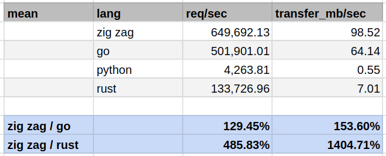
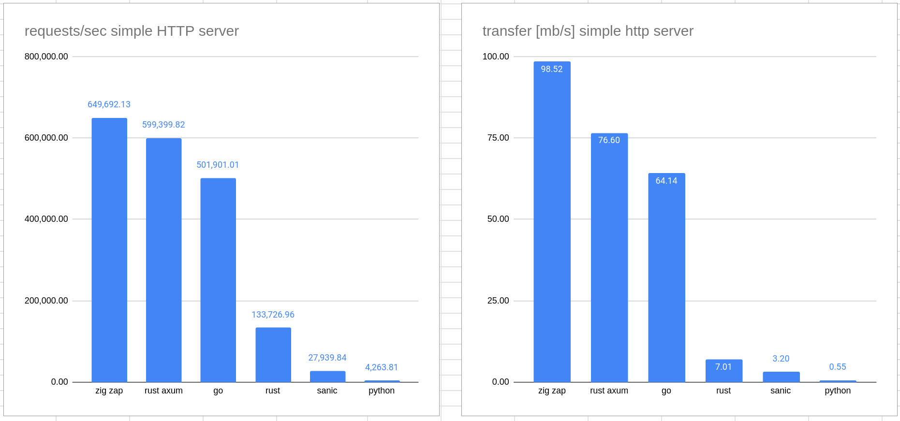

# ⚡zap⚡ - blazingly fast backends in zig


Zap is intended to become the [zig](https://ziglang.org) replacement for the
kind of REST APIs I used to write in [python](https://python.org) with
[Flask](https://flask.palletsprojects.com) and
[mongodb](https://www.mongodb.com), etc. It can be considered to be a
microframework for web applications.

What I need for that is a blazingly fast, robust HTTP server that I can use with
zig. While facil.io supports TLS, I don't care about HTTPS support. In
production, I use [nginx](https://www.nginx.com) as a reverse proxy anyway.

Zap wraps and patches [facil.io - the C web application
framework](https://facil.io).

**⚡ZAP⚡ IS SUPER ALPHA**

_Under the hood, everything is super robust and fast. My zig wrappers are fresh,
juicy, and alpha._

Here's what works:

- **Super easy build process**: zap's `build.zig` now uses the up-and-coming
  zig package manager for its C-dependencies, no git submodules anymore.
  - _tested on Linux and macOS (arm, M1)_
- **[hello](examples/hello/hello.zig)**: welcomes you with some static
  HTML
- **[routes](examples/routes/routes.zig)**: a super easy example
  dispatching on the HTTP path 
- **[serve](examples/serve/serve.zig)**: the traditional static web
  server with optional dynamic request handling
- **[hello_json](examples/hello_json/hello_json.zig)**: serves you json
  dependent on HTTP path
- **[endpoint](examples/endpoint/)**: a simple JSON REST API example featuring
  a `/users` endpoint for PUTting/DELETE-ing/GET-ting/POST-ing and listing
  users, together with a static HTML and JavaScript frontend to play with.

I'll continue wrapping more of facil.io's functionality and adding stuff to zap
to a point where I can use it as the JSON REST API backend for real research
projects, serving thousands of concurrent clients.

## ⚡blazingly fast⚡

Claiming to be blazingly fast is the new black. At least, zap doesn't slow you
down and if your server performs poorly, it's probably not exactly zap's fault.
Zap relies on the [facil.io](https://facil.io) framework and so it can't really
claim any performance fame for itself. In this initial implementation of zap,
I didn't care about optimizations at all.

But, how fast is it? Being blazingly fast is relative. When compared with a
simple GO HTTP server, a simple zig zap HTTP server performed really good on my
machine:

- zig zap was nearly 30% faster than GO
- zig zap had over 50% more throughput than GO

**Update**: I was intrigued comparing to a basic rust HTTP server.
Unfortunately, knowing nothing at all about rust, I couldn't find one and hence
tried to go for the one in [The Rust Programming
Language](https://doc.rust-lang.org/book/ch20-00-final-project-a-web-server.html).
Wanting it to be of a somewhat fair comparison, I opted for the multi-threaded
example. It didn't work out-of-the-box, but I got it to work and changed it to
not read files but outputting a static text just like in the other examples.
**maybe someone with rust experience** can have a look at my
[wrk/rust/hello](wrk/rust/hello) code and tell me why it's surprisingly slow, as
I expected it to be faster than the basic GO example. I'll enable the
GitHub discussions for this matter. My suspicion is bad performance of the
mutexes.





So, being somewhere in the ballpark of basic GO performance, zig zap seems to be
... of reasonable performance 😎.

See more details in [blazingly-fast.md](blazingly-fast.md).

## Getting started

```shell
$ git clone https://github.com/zigzap/zap.git
$ cd zap 
$ zig build run-hello
$ # open http://localhost:3000 in your browser
```

... and open [http://localhost:3000](http://locahhost:3000) in your browser.

## Using ⚡zap⚡ in your own projects 

If you don't have an existing zig project, create one like this:

```shell 
$ mkdir zaptest && cd zaptest
$ zig init-exe
$ git init      ## (optional)
```
**Note 1**: Zap is developed with zig master (0.11.0-dev.1602+d976b4e4a at the
time of writing). This version of zig has the package management features in
place that are used in the following instructions. Nix users are lucky; you can
use the existing `flake.nix` and run `nix develop` to get a development shell
providing zig, and also all dependencies to build the and run the GO, python, 
and rust examples for the `wrk` performance tests.

With an existing zig project, adding zap to it is easy:

1. Add zap to your `build.zig.zon` 
2. Add zap to your `build.zig` 

To add zap to `build.zig.zon`:

```zig 
.{
    .name = "myapp",
    .version = "0.0.1",

    .dependencies = .{
        .zap = .{
            .url = "https://github.com/zigzap/zap/archive/db6496cd7afc6bac50da563936021ee28f591dc1.tar.gz",
            .hash = "12203791cdbf4ebc2692bbd2ce790fedbc2e7295eec3efd7812621aa35a5ce83767a",
        },
        .@"facil.io" = .{
            .url = "https://github.com/zigzap/facil.io/archive/2c04cd1949328dd62fe5d262b9cc930e54392ab8.tar.gz",
            .hash = "12209d3b552145f24431e5a2e6a4ad59ceaa9656f7fba8af7a8aa704a8784a79f55d",
        }
    }
}
```

**Note 2**: change the URLs to the latest commit of `zap` and `facil.io`
respectively (my fork). The latter is unlikely to change; but `zap` is likely to
change more frequently.


Then, in your `build.zig`'s `build` function, add the following before
`exe.install()`:

```zig 
    const zap = b.dependency("zap", .{
        .target = target,
        .optimize = optimize,
    });
    exe.addModule("zap", zap.module("zap"));

    const facil_dep = b.dependency("facil.io", .{
        .target = target,
        .optimize = optimize,
    });
    exe.linkLibrary(facil_dep.artifact("facil.io"));
```

From then on, you can use the zap package in your project. Check out the
examples to see how to use zap.

## Contribute to ⚡zap⚡ - blazingly fast

At the current time, I can only add to zap what I need for my personal and
professional projects. While this happens **blazingly fast**, some if not all
nice-to-have additions will have to wait. You are very welcome to help make the
world a blazingly fast place by providing patches or pull requests, add
documentation or examples, or interesting issues and bug reports - you'll know
what to do when you receive your calling 👼.

Check out [CONTRIBUTING.md](CONTRIBUTING.md) for more details.

See also [introducing.md](introducing.md) for more on the state and progress of
this project.

You can also reach me on [the zig showtime discord
server](https://discord.gg/CBzE3VMb) under the handle renerocksai
(renerocksai#1894).

## Support ⚡zap⚡ 

Being blazingly fast requires a constant feed of caffeine. I usually manage to
provide that to myself for myself. However, to support keeping the juices
flowing and putting a smile on my face and that warm and cozy feeling into my
heart, you can always [buy me a coffee](https://buymeacoffee.com/renerocksai)
☕. All donations are welcomed 🙏 blazingly fast! That being said, just saying
"hi" also works wonders with the smiles, warmth, and coziness 😊.

## Examples

You build and run the examples via:

```shell
$ zig build [EXAMPLE]
$ ./zig-out/bin/[EXAMPLE]
```

... where `[EXAMPLE]` is one of `hello`, `routes`, or `serve`.

Example: building and running the hello example:

```shell 
$ zig build hello 
$ ./zig-out/bin/hello
```

To just run an example, like `routes`, without generating an executable, run:

```shell
$ zig build run-[EXAMPLE]
```

Example: building and running the routes example:

```shell
$ zig build run-routes
```

### [hello](examples/hello/hello.zig)

```zig
const std = @import("std");
const zap = @import("zap");

fn on_request(r: zap.SimpleRequest) void {
    if (r.path) |the_path| {
        std.debug.print("PATH: {s}\n", .{the_path});
    }

    if (r.query) |the_query| {
        std.debug.print("QUERY: {s}\n", .{the_query});
    }
    _ = r.sendBody("<html><body><h1>Hello from ZAP!!!</h1></body></html>");
}

pub fn main() !void {
    var listener = zap.SimpleHttpListener.init(.{
        .port = 3000,
        .on_request = on_request,
        .log = true,
    });
    try listener.listen();

    std.debug.print("Listening on 0.0.0.0:3000\n", .{});

    // start worker threads
    zap.start(.{
        .threads = 2,
        .workers = 2,
    });
}
```

