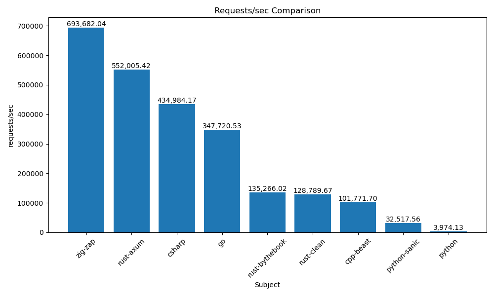
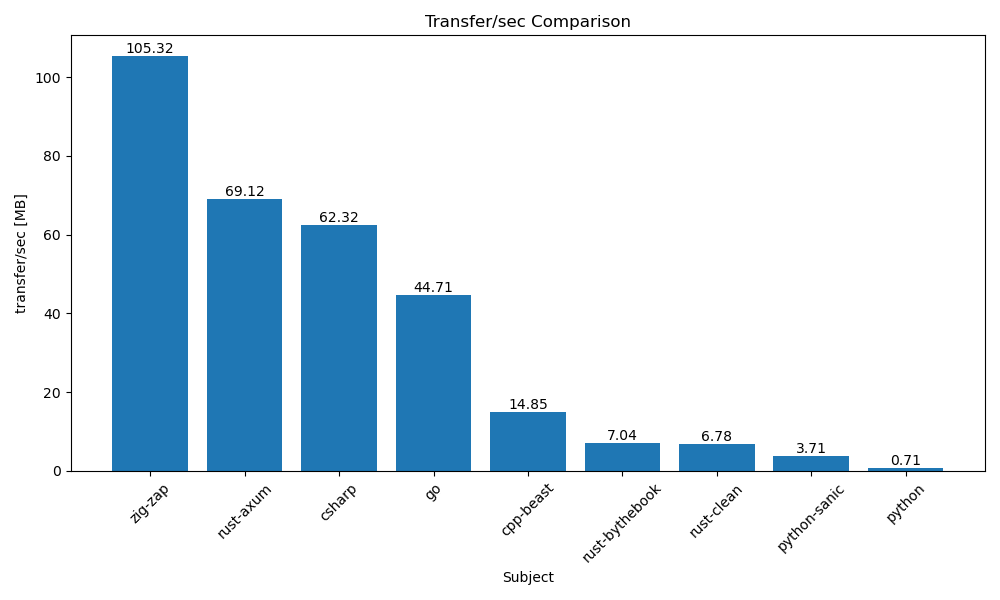
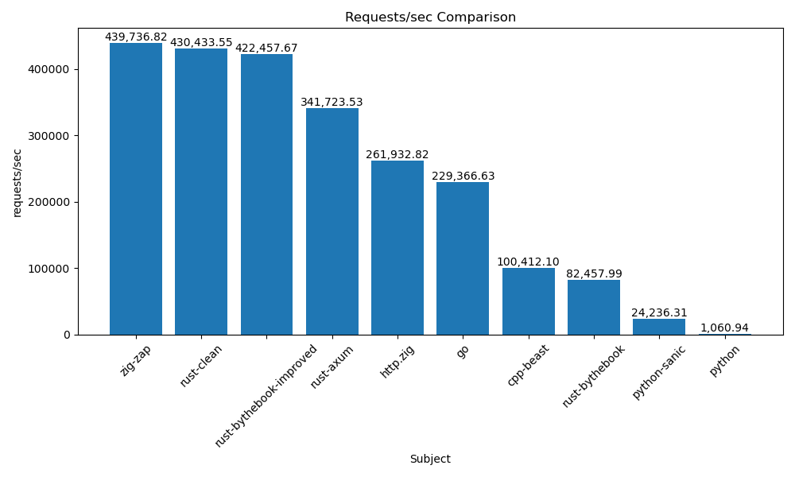
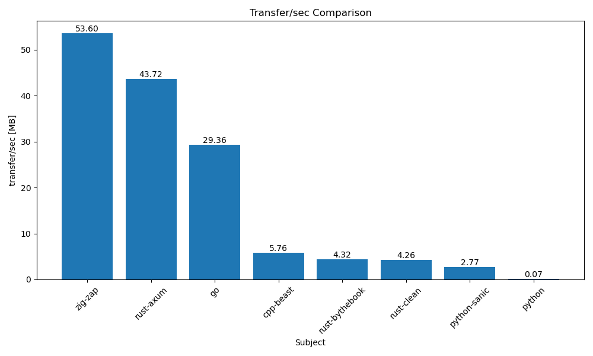
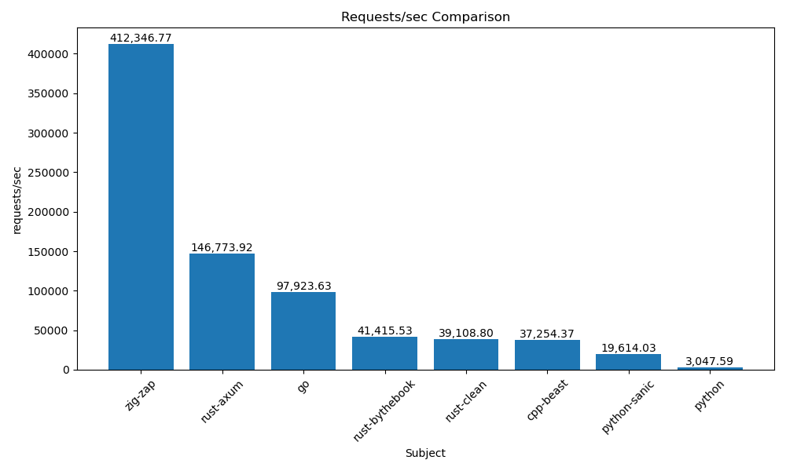
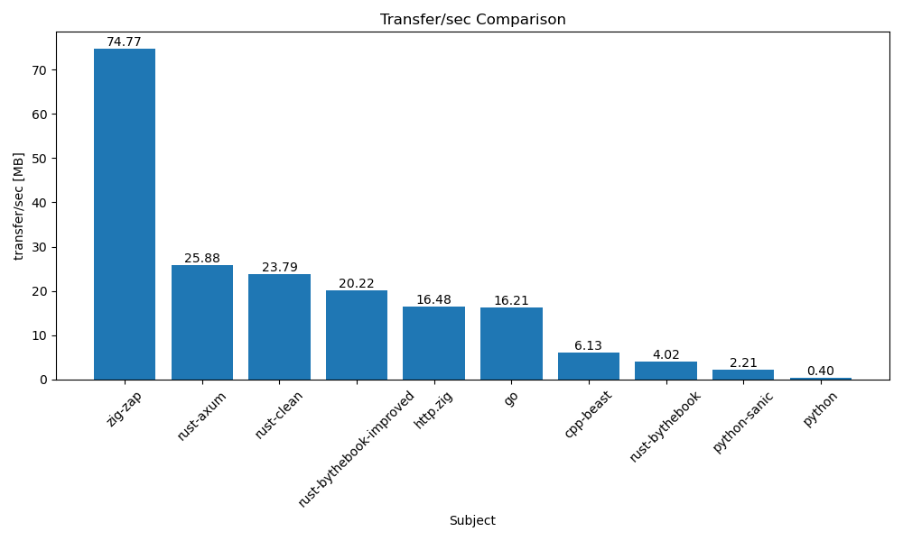

# ⚡blazingly fast⚡

Initially, I conducted a series of quick tests, using wrk with simple HTTP
servers written in GO and in zig zap. I made sure that all servers only output
17 bytes of HTTP body.

Just to get some sort of indication, I also included measurements for python
since I used to write my REST APIs in python before creating zig zap.

You can check out the scripts I used for the tests in [./wrk](wrk/).

## Why 

I aimed to enhance the performance of my Python + Flask backends by replacing
them with a Zig version. To evaluate the success of this transition, I compared
the performance of a static HTTP server implemented in Python and its Zig
counterpart, which showed significant improvements. 

To further assess the Zig server's performance, I compared it with a Go
implementation, to compare against a widely used industry-standard. I expected
similar performance levels but was pleasantly surprised when Zap outperformed Go
by approximately 30% on my test machine. 

Intrigued by Rust's reputed performance capabilities, I also experimented with a
Rust version. The results of this experiment are discussed in the
[Flaws](#flaws) section below.

## What 

So, what are the benchmarks testing?

- simple http servers that reply to GET requests with a constant, 17-bytes long response
- 4 cores are assigned to the subject under test (the respective server)
- 4 cores are assigned to `wrk`
    - using 4 threads
    - aiming at 400 concurrent connections

## How

I have fully automated the benchmarks and graph generation.

To generate the data:

```console
$ ./wrk/measure_all.sh
```

To generate the graphs:

```console
$ python wrk/graph.py
```

For dependencies, please see the [flake.nix](./flake.nix#L46).

## Flaws

The benchmarks have limitations, such as the lack of request latencies. The Rust
community has often criticized these benchmarks as biased. However, no such
criticisms have come from the Go or Python communities.

In response to the Rust community's concerns, we've added three Rust
implementations for comparison:

- A standard version from [the Rust book](https://doc.rust-lang.org/book/ch20-00-final-project-a-web-server.html).
- An "axum" version to highlight Rust's speed.
- A refined version of the Rust book version.

Originally, the goal was to compare "batteries included" versions, which created
a disparity by comparing the optimized zap / facil.io code with basic bundled
functionalities. These tests were for personal interest and not meant to be
definitive benchmarks.

To address this bias, we've added the Rust-axum and Python-sanic benchmarks. For
more information, refer to the relevant discussions and pull requests.


## More benchmarks?

I often receive requests or PRs to include additional benchmarks, which a lot of
times I find to be either ego-driven or a cause for unnecessary disputes. People
tend to favor their preferred language or framework. Zig, Rust, C, and C++ are
all capable of efficiently creating fast web servers, with different frameworks
potentially excelling in certain benchmarks. My main concern was whether Zap,
given its current level of abstraction, could compete with standard web servers.
This question has been answered, and I see no need for further benchmarks.

So far, we have the following benchmark subjects (implementations) which you'll
find in the graphs below:

- **zig-zap** : ZAP implementation
- **go** : GO implementation
- **python** : Python implementation
- **python-sanic** : Python implementation with sanic framework
- **rust-bythebook** : Rust example from the Rust book (not representative)
- **rust-bythebook-improved** : Improved version of the by-the-book code (thx @alexpyattaev)
- **rust-clean** : A clean, straight-forward Rust implementation (thx @alexpyattaev)
- **rust-axum** : Rust implementation using the axum framework (realistic)
- **(csharp)** : CSharp implementation (thx @leo-costa)
- **cpp-beast** : A C++ implementation using boost::beast (thx @kassane)


## The computer makes the difference

After automating the performance benchmarks, I gathered data from three
different computers. It's interesting to see the variation in relative numbers.


### The test machine (graphs in the README)





```
➜ neofetch --stdout
rs@ryzen 
-------- 
OS: NixOS 23.05.997.ddf4688dc7a (Stoat) x86_64 
Host: Micro-Star International Co., Ltd. B550-A PRO (MS-7C56) 
Kernel: 6.3.7 
Uptime: 15 days, 11 hours, 13 mins 
Packages: 2094 (nix-system), 1356 (nix-user), 7 (flatpak) 
Shell: bash 5.2.15 
Resolution: 3840x2160 
DE: none+i3 
WM: i3 
Terminal: tmux 
CPU: AMD Ryzen 5 5600X (12) @ 3.700GHz 
GPU: AMD ATI Radeon RX 6700/6700 XT/6750 XT / 6800M/6850M XT 
Memory: 4981MiB / 32028MiB 


➜ lscpu
Architecture:            x86_64
  CPU op-mode(s):        32-bit, 64-bit
  Address sizes:         48 bits physical, 48 bits virtual
  Byte Order:            Little Endian
CPU(s):                  12
  On-line CPU(s) list:   0-11
Vendor ID:               AuthenticAMD
  Model name:            AMD Ryzen 5 5600X 6-Core Processor
    CPU family:          25
    Model:               33
    Thread(s) per core:  2
    Core(s) per socket:  6
    Socket(s):           1
    Stepping:            0
    Frequency boost:     enabled
    CPU(s) scaling MHz:  67%
    CPU max MHz:         4650.2920
    CPU min MHz:         2200.0000
    BogoMIPS:            7399.43
    Flags:               fpu vme de pse tsc msr pae mce cx8 apic sep mtrr pge mca cmov pat pse36 clflush mmx fxsr sse sse2 ht syscall nx mmxext fxsr_opt 
                         pdpe1gb rdtscp lm constant_tsc rep_good nopl nonstop_tsc cpuid extd_apicid aperfmperf rapl pni pclmulqdq monitor ssse3 fma cx16 
                         sse4_1 sse4_2 movbe popcnt aes xsave avx f16c rdrand lahf_lm cmp_legacy svm extapic cr8_legacy abm sse4a misalignsse 3dnowprefet
                         ch osvw ibs skinit wdt tce topoext perfctr_core perfctr_nb bpext perfctr_llc mwaitx cpb cat_l3 cdp_l3 hw_pstate ssbd mba ibrs ib
                         pb stibp vmmcall fsgsbase bmi1 avx2 smep bmi2 erms invpcid cqm rdt_a rdseed adx smap clflushopt clwb sha_ni xsaveopt xsavec xget
                         bv1 xsaves cqm_llc cqm_occup_llc cqm_mbm_total cqm_mbm_local clzero irperf xsaveerptr rdpru wbnoinvd arat npt lbrv svm_lock nrip
                         _save tsc_scale vmcb_clean flushbyasid decodeassists pausefilter pfthreshold avic v_vmsave_vmload vgif v_spec_ctrl umip pku ospk
                         e vaes vpclmulqdq rdpid overflow_recov succor smca fsrm
Virtualization features: 
  Virtualization:        AMD-V
Caches (sum of all):     
  L1d:                   192 KiB (6 instances)
  L1i:                   192 KiB (6 instances)
  L2:                    3 MiB (6 instances)
  L3:                    32 MiB (1 instance)
NUMA:                    
  NUMA node(s):          1
  NUMA node0 CPU(s):     0-11
Vulnerabilities:         
  Itlb multihit:         Not affected
  L1tf:                  Not affected
  Mds:                   Not affected
  Meltdown:              Not affected
  Mmio stale data:       Not affected
  Retbleed:              Not affected
  Spec store bypass:     Mitigation; Speculative Store Bypass disabled via prctl
  Spectre v1:            Mitigation; usercopy/swapgs barriers and __user pointer sanitization
  Spectre v2:            Mitigation; Retpolines, IBPB conditional, IBRS_FW, STIBP always-on, RSB filling, PBRSB-eIBRS Not affected
  Srbds:                 Not affected
  Tsx async abort:       Not affected
```

### Workstation at work

A beast. Many cores (which we don't use). 





```
[rene@nixos:~]$ neofetch --stdout
rene@nixos 
---------- 
OS: NixOS 23.05.2947.475d5ae2c4cb (Stoat) x86_64 
Host: LENOVO 1038 
Kernel: 6.1.46 
Uptime: 26 mins 
Packages: 5804 (nix-system), 566 (nix-user) 
Shell: bash 5.2.15 
Terminal: /dev/pts/2 
CPU: Intel Xeon Gold 5218 (64) @ 3.900GHz 
GPU: NVIDIA Quadro P620 
GPU: NVIDIA Tesla M40 
Memory: 1610MiB / 95247MiB 


[rene@nixos:~]$ lscpu
Architecture:            x86_64
  CPU op-mode(s):        32-bit, 64-bit
  Address sizes:         46 bits physical, 48 bits virtual
  Byte Order:            Little Endian
CPU(s):                  64
  On-line CPU(s) list:   0-63
Vendor ID:               GenuineIntel
  Model name:            Intel(R) Xeon(R) Gold 5218 CPU @ 2.30GHz
    CPU family:          6
    Model:               85
    Thread(s) per core:  2
    Core(s) per socket:  16
    Socket(s):           2
    Stepping:            7
    CPU(s) scaling MHz:  57%
    CPU max MHz:         3900,0000
    CPU min MHz:         1000,0000
    BogoMIPS:            4600,00
    Flags:               fpu vme de pse tsc msr pae mce cx8 apic sep mtrr pge mca cmov pat pse36 clflush dts acpi mmx fxsr sse sse2 ss ht tm pbe syscall nx pdpe1gb rdtscp lm constant_tsc art arch_perfmon pebs b
                         ts rep_good nopl xtopology nonstop_tsc cpuid aperfmperf pni pclmulqdq dtes64 monitor ds_cpl vmx smx est tm2 ssse3 sdbg fma cx16 xtpr pdcm pcid dca sse4_1 sse4_2 x2apic movbe popcnt tsc_
                         deadline_timer aes xsave avx f16c rdrand lahf_lm abm 3dnowprefetch cpuid_fault epb cat_l3 cdp_l3 invpcid_single intel_ppin ssbd mba ibrs ibpb stibp ibrs_enhanced tpr_shadow vnmi flexpri
                         ority ept vpid ept_ad fsgsbase tsc_adjust bmi1 avx2 smep bmi2 erms invpcid cqm mpx rdt_a avx512f avx512dq rdseed adx smap clflushopt clwb intel_pt avx512cd avx512bw avx512vl xsaveopt xs
                         avec xgetbv1 xsaves cqm_llc cqm_occup_llc cqm_mbm_total cqm_mbm_local dtherm ida arat pln pts hwp hwp_act_window hwp_epp hwp_pkg_req pku ospke avx512_vnni md_clear flush_l1d arch_capabi
                         lities
Virtualization features: 
  Virtualization:        VT-x
Caches (sum of all):     
  L1d:                   1 MiB (32 instances)
  L1i:                   1 MiB (32 instances)
  L2:                    32 MiB (32 instances)
  L3:                    44 MiB (2 instances)
NUMA:                    
  NUMA node(s):          2
  NUMA node0 CPU(s):     0-15,32-47
  NUMA node1 CPU(s):     16-31,48-63
Vulnerabilities:         
  Gather data sampling:  Mitigation; Microcode
  Itlb multihit:         KVM: Mitigation: VMX disabled
  L1tf:                  Not affected
  Mds:                   Not affected
  Meltdown:              Not affected
  Mmio stale data:       Mitigation; Clear CPU buffers; SMT vulnerable
  Retbleed:              Mitigation; Enhanced IBRS
  Spec rstack overflow:  Not affected
  Spec store bypass:     Mitigation; Speculative Store Bypass disabled via prctl
  Spectre v1:            Mitigation; usercopy/swapgs barriers and __user pointer sanitization
  Spectre v2:            Mitigation; Enhanced IBRS, IBPB conditional, RSB filling, PBRSB-eIBRS SW sequence
  Srbds:                 Not affected
  Tsx async abort:       Mitigation; TSX disabled
```


### Work Laptop

Very strange. It absolutely **LOVES** zap 🤣!





```
➜ neofetch --stdout
rs@nixos
--------
OS: NixOS 23.05.2918.4cdad15f34e6 (Stoat) x86_64
Host: LENOVO 20TKS0W700
Kernel: 6.1.45
Uptime: 1 day, 4 hours, 50 mins
Packages: 6259 (nix-system), 267 (nix-user), 9 (flatpak)
Shell: bash 5.2.15
Resolution: 3840x1600, 3840x2160
DE: none+i3
WM: i3
Terminal: tmux
CPU: Intel i9-10885H (16) @ 5.300GHz
GPU: NVIDIA GeForce GTX 1650 Ti Mobile
Memory: 4525MiB / 31805MiB


➜ lscpu
Architecture:                       x86_64
CPU op-mode(s):                     32-bit, 64-bit
Address sizes:                      39 bits physical, 48 bits virtual
Byte Order:                         Little Endian
CPU(s):                             16
On-line CPU(s) list:                0-15
Vendor ID:                          GenuineIntel
Model name:                         Intel(R) Core(TM) i9-10885H CPU @ 2.40GHz
CPU family:                         6
Model:                              165
Thread(s) per core:                 2
Core(s) per socket:                 8
Socket(s):                          1
Stepping:                           2
CPU(s) scaling MHz:                 56%
CPU max MHz:                        5300.0000
CPU min MHz:                        800.0000
BogoMIPS:                           4800.00
Flags:                              fpu vme de pse tsc msr pae mce cx8 apic sep mtrr pge mca cmov pat pse36 clflush dts acpi mmx fxsr sse sse2 ss ht tm pbe syscall nx pdpe1gb rdtscp lm constant_tsc art arch_perfmon pebs bts rep_good nopl xtopology nonstop_tsc cpuid aperfmperf pni pclmulqdq dtes64 monitor ds_cpl vmx smx est tm2 ssse3 sdbg fma cx16 xtpr pdcm pcid sse4_1 sse4_2 x2apic movbe popcnt tsc_deadline_timer aes xsave avx f16c rdrand lahf_lm abm 3dnowprefetch cpuid_fault epb invpcid_single ssbd ibrs ibpb stibp ibrs_enhanced tpr_shadow vnmi flexpriority ept vpid ept_ad fsgsbase tsc_adjust sgx bmi1 avx2 smep bmi2 erms invpcid mpx rdseed adx smap clflushopt intel_pt xsaveopt xsavec xgetbv1 xsaves dtherm ida arat pln pts hwp hwp_notify hwp_act_window hwp_epp pku ospke sgx_lc md_clear flush_l1d arch_capabilities
Virtualization:                     VT-x
L1d cache:                          256 KiB (8 instances)
L1i cache:                          256 KiB (8 instances)
L2 cache:                           2 MiB (8 instances)
L3 cache:                           16 MiB (1 instance)
NUMA node(s):                       1
NUMA node0 CPU(s):                  0-15
Vulnerability Gather data sampling: Mitigation; Microcode
Vulnerability Itlb multihit:        KVM: Mitigation: VMX disabled
Vulnerability L1tf:                 Not affected
Vulnerability Mds:                  Not affected
Vulnerability Meltdown:             Not affected
Vulnerability Mmio stale data:      Mitigation; Clear CPU buffers; SMT vulnerable
Vulnerability Retbleed:             Mitigation; Enhanced IBRS
Vulnerability Spec rstack overflow: Not affected
Vulnerability Spec store bypass:    Mitigation; Speculative Store Bypass disabled via prctl
Vulnerability Spectre v1:           Mitigation; usercopy/swapgs barriers and __user pointer sanitization
Vulnerability Spectre v2:           Mitigation; Enhanced IBRS, IBPB conditional, RSB filling, PBRSB-eIBRS SW sequence
Vulnerability Srbds:                Mitigation; Microcode
Vulnerability Tsx async abort:      Not affected
```

