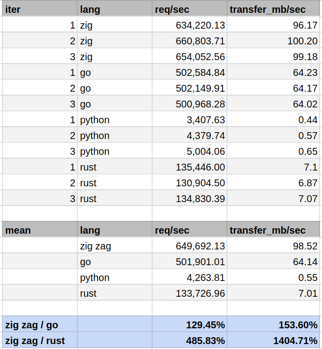
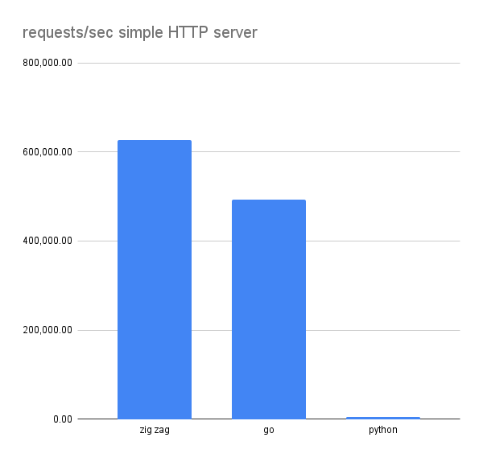
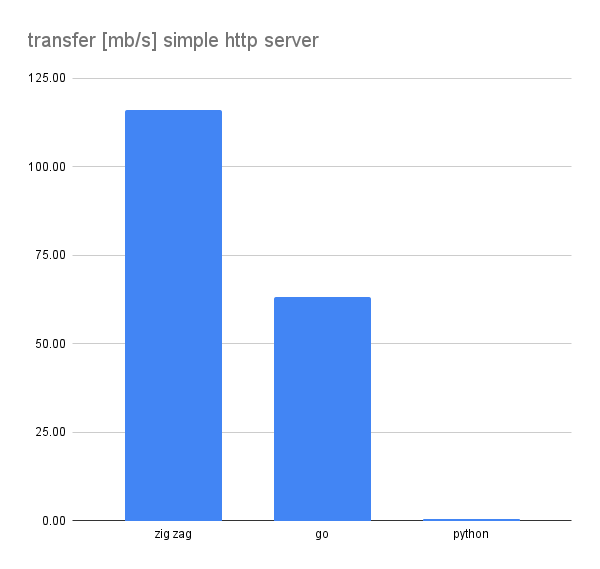

# ⚡blazingly fast⚡

I conducted a series of quick tests, using wrk with simple HTTP servers written
in GO and in zig zap. I made sure that all servers only output 17 bytes of HTTP
body.

Just to get some sort of indication, I also included measurements for python
since I used to write my REST APIs in python before creating zig zap.

You can check out the scripts I used for the tests in [./wrk](wrk/).

## results

You can see the verbatim output of `wrk`, and some infos about the test machine
below the code snippets.

**Update**: I was intrigued comparing to a basic rust HTTP server.
Unfortunately, knowing nothing at all about rust, I couldn't find one and hence
tried to go for the one in [The Rust Programming
Language](https://doc.rust-lang.org/book/ch20-00-final-project-a-web-server.html).
Wanting it to be of a somewhat fair comparison, I opted for the multi-threaded
example. It didn't work out-of-the-box, but I got it to work and changed it to
not read files but outputting a static text just like in the other examples.
**maybe someone with rust experience** can have a look at my
[wrk/rust/hello](wrk/rust/hello) code and tell me why it's surprisingly slow, as
I expected it to be faster than the basic GO example. I'll enable the
GitHub discussions for this matter. My suspicion is bad performance of the
mutexes.



### requests / sec



### transfer MB / sec




## zig code 

zig version .11.0-dev.1265+3ab43988c

```zig 
const std = @import("std");
const zap = @import("zap");

fn on_request_minimal(r: zap.SimpleRequest) void {
    _ = r.sendBody("Hello from ZAP!!!");
}

pub fn main() !void {
    var listener = zap.SimpleHttpListener.init(.{
        .port = 3000,
        .on_request = on_request_minimal,
        .log = false,
        .max_clients = 100000,
    });
    try listener.listen();

    std.debug.print("Listening on 0.0.0.0:3000\n", .{});

    // start worker threads
    zap.start(.{
        .threads = 4,
        .workers = 4,
    });
}
```

## go code 

go version go1.16.9 linux/amd64

```go 
package main

import (
	"fmt"
	"net/http"
)

func hello(w http.ResponseWriter, req *http.Request) {
	fmt.Fprintf(w, "hello from GO!!!\n")
}

func main() {
	print("listening on 0.0.0.0:8090\n")
	http.HandleFunc("/hello", hello)
	http.ListenAndServe(":8090", nil)
}
```

## python code

python version 3.9.6

```python 
# Python 3 server example
from http.server import BaseHTTPRequestHandler, HTTPServer

hostName = "127.0.0.1"
serverPort = 8080


class MyServer(BaseHTTPRequestHandler):
    def do_GET(self):
        self.send_response(200)
        self.send_header("Content-type", "text/html")
        self.end_headers()
        self.wfile.write(bytes("HI FROM PYTHON!!!", "utf-8"))

    def log_message(self, format, *args):
        return


if __name__ == "__main__":
    webServer = HTTPServer((hostName, serverPort), MyServer)
    print("Server started http://%s:%s" % (hostName, serverPort))

    try:
        webServer.serve_forever()
    except KeyboardInterrupt:
        pass

    webServer.server_close()
    print("Server stopped.")
```

## rust code 

[main.rs](wrk/rust/hello/src/main.rs)

```rust
use hello::ThreadPool;
use std::io::prelude::*;
use std::net::TcpListener;
use std::net::TcpStream;

fn main() {
    let listener = TcpListener::bind("127.0.0.1:7878").unwrap();
    let pool = ThreadPool::new(4);

    // for stream in listener.incoming().take(2) {
    for stream in listener.incoming() {
        let stream = stream.unwrap();

        pool.execute(|| {
            handle_connection(stream);
        });
    }

    println!("Shutting down.");
}

fn handle_connection(mut stream: TcpStream) {
    let mut buffer = [0; 1024];
    stream.read(&mut buffer).unwrap();


    let status_line = "HTTP/1.1 200 OK";

    let contents = "HELLO from RUST!";

    let response = format!(
        "{}\r\nContent-Length: {}\r\n\r\n{}",
        status_line,
        contents.len(),
        contents
    );

    stream.write_all(response.as_bytes()).unwrap();
    stream.flush().unwrap();
}
```

[lib.rs](wrk/rust/hello/src/lib.rs)

```rust
use std::{
    sync::{mpsc, Arc, Mutex},
    thread,
};

pub struct ThreadPool {
    workers: Vec<Worker>,
    sender: Option<mpsc::Sender<Job>>,
}

type Job = Box<dyn FnOnce() + Send + 'static>;

impl ThreadPool {
    /// Create a new ThreadPool.
    ///
    /// The size is the number of threads in the pool.
    ///
    /// # Panics
    ///
    /// The `new` function will panic if the size is zero.
    pub fn new(size: usize) -> ThreadPool {
        assert!(size > 0);

        let (sender, receiver) = mpsc::channel();

        let receiver = Arc::new(Mutex::new(receiver));

        let mut workers = Vec::with_capacity(size);

        for id in 0..size {
            workers.push(Worker::new(id, Arc::clone(&receiver)));
        }

        ThreadPool {
            workers,
            sender: Some(sender),
        }
    }

    pub fn execute<F>(&self, f: F)
    where
        F: FnOnce() + Send + 'static,
    {
        let job = Box::new(f);

        self.sender.as_ref().unwrap().send(job).unwrap();
    }
}

impl Drop for ThreadPool {
    fn drop(&mut self) {
        drop(self.sender.take());

        for worker in &mut self.workers {
            println!("Shutting down worker {}", worker.id);

            if let Some(thread) = worker.thread.take() {
                thread.join().unwrap();
            }
        }
    }
}

struct Worker {
    id: usize,
    thread: Option<thread::JoinHandle<()>>,
}

impl Worker {
    fn new(id: usize, receiver: Arc<Mutex<mpsc::Receiver<Job>>>) -> Worker {
        let thread = thread::spawn(move || loop {
            let message = receiver.lock().unwrap().recv();

            match message {
                Ok(job) => {
                    // println!("Worker  got a job; executing.");

                    job();
                }
                Err(_) => {
                    // println!("Worker  disconnected; shutting down.");
                    break;
                }
            }
        });

        Worker {
            id,
            thread: Some(thread),
        }
    }
}
```

## wrk output

wrk version: `wrk 4.1.0 [epoll] Copyright (C) 2012 Will Glozer`

```
(base) rs@ryzen:~/code/github.com/renerocksai/zap$ ./wrk/measure.sh zig
Listening on 0.0.0.0:3000
========================================================================
                          zig
========================================================================
Running 10s test @ http://127.0.0.1:3000
  4 threads and 400 connections
  Thread Stats   Avg      Stdev     Max   +/- Stdev
    Latency   331.40us  115.09us   8.56ms   91.94%
    Req/Sec   159.51k     9.44k  175.23k    56.50%
  Latency Distribution
     50%  312.00us
     75%  341.00us
     90%  375.00us
     99%  681.00us
  6348945 requests in 10.01s, 0.94GB read
Requests/sec: 634220.13
Transfer/sec:     96.17MB
(base) rs@ryzen:~/code/github.com/renerocksai/zap$ 

(base) rs@ryzen:~/code/github.com/renerocksai/zap$ ./wrk/measure.sh zig
Listening on 0.0.0.0:3000
========================================================================
                          zig
========================================================================
Running 10s test @ http://127.0.0.1:3000
  4 threads and 400 connections
  Thread Stats   Avg      Stdev     Max   +/- Stdev
    Latency   322.43us  103.25us   3.72ms   86.57%
    Req/Sec   166.35k     2.89k  182.78k    68.00%
  Latency Distribution
     50%  297.00us
     75%  330.00us
     90%  482.00us
     99%  657.00us
  6619245 requests in 10.02s, 0.98GB read
Requests/sec: 660803.71
Transfer/sec:    100.20MB
(base) rs@ryzen:~/code/github.com/renerocksai/zap$ 

(base) rs@ryzen:~/code/github.com/renerocksai/zap$ ./wrk/measure.sh zig
Listening on 0.0.0.0:3000
========================================================================
                          zig
========================================================================
Running 10s test @ http://127.0.0.1:3000
  4 threads and 400 connections
  Thread Stats   Avg      Stdev     Max   +/- Stdev
    Latency   325.47us  105.86us   4.03ms   87.27%
    Req/Sec   164.60k     4.69k  181.85k    84.75%
  Latency Distribution
     50%  300.00us
     75%  333.00us
     90%  430.00us
     99%  667.00us
  6549594 requests in 10.01s, 0.97GB read
Requests/sec: 654052.56
Transfer/sec:     99.18MB
(base) rs@ryzen:~/code/github.com/renerocksai/zap$ 

(base) rs@ryzen:~/code/github.com/renerocksai/zap$ ./wrk/measure.sh go
listening on 0.0.0.0:8090
========================================================================
                          go
========================================================================
Running 10s test @ http://127.0.0.1:8090/hello
  4 threads and 400 connections
  Thread Stats   Avg      Stdev     Max   +/- Stdev
    Latency   680.63us  692.05us  12.09ms   88.04%
    Req/Sec   126.49k     4.28k  139.26k    71.75%
  Latency Distribution
     50%  403.00us
     75%  822.00us
     90%    1.52ms
     99%    3.34ms
  5033360 requests in 10.01s, 643.22MB read
Requests/sec: 502584.84
Transfer/sec:     64.23MB
(base) rs@ryzen:~/code/github.com/renerocksai/zap$ ./wrk/measure.sh go
listening on 0.0.0.0:8090
========================================================================
                          go
========================================================================
Running 10s test @ http://127.0.0.1:8090/hello
  4 threads and 400 connections
  Thread Stats   Avg      Stdev     Max   +/- Stdev
    Latency   683.97us  695.78us  10.01ms   88.04%
    Req/Sec   126.31k     4.34k  137.63k    65.00%
  Latency Distribution
     50%  408.00us
     75%  829.00us
     90%    1.53ms
     99%    3.34ms
  5026848 requests in 10.01s, 642.39MB read
Requests/sec: 502149.91
Transfer/sec:     64.17MB
(base) rs@ryzen:~/code/github.com/renerocksai/zap$ ./wrk/measure.sh go
listening on 0.0.0.0:8090
========================================================================
                          go
========================================================================
Running 10s test @ http://127.0.0.1:8090/hello
  4 threads and 400 connections
  Thread Stats   Avg      Stdev     Max   +/- Stdev
    Latency   688.89us  702.75us  12.70ms   88.09%
    Req/Sec   126.06k     4.20k  138.00k    70.25%
  Latency Distribution
     50%  414.00us
     75%  836.00us
     90%    1.54ms
     99%    3.36ms
  5015716 requests in 10.01s, 640.97MB read
Requests/sec: 500968.28
Transfer/sec:     64.02MB
(base) rs@ryzen:~/code/github.com/renerocksai/zap$ ./wrk/measure.sh python
Server started http://127.0.0.1:8080
========================================================================
                          python
========================================================================
Running 10s test @ http://127.0.0.1:8080
  4 threads and 400 connections
  Thread Stats   Avg      Stdev     Max   +/- Stdev
    Latency    12.89ms  101.69ms   1.79s    97.76%
    Req/Sec     1.83k     2.11k    7.53k    82.18%
  Latency Distribution
     50%  215.00us
     75%  260.00us
     90%  363.00us
     99%  485.31ms
  34149 requests in 10.02s, 4.33MB read
  Socket errors: connect 0, read 34149, write 0, timeout 15
Requests/sec:   3407.63
Transfer/sec:    442.60KB
(base) rs@ryzen:~/code/github.com/renerocksai/zap$ ./wrk/measure.sh python
Server started http://127.0.0.1:8080
========================================================================
                          python
========================================================================
Running 10s test @ http://127.0.0.1:8080
  4 threads and 400 connections
  Thread Stats   Avg      Stdev     Max   +/- Stdev
    Latency     9.87ms   90.32ms   1.79s    98.21%
    Req/Sec     2.16k     2.17k    7.49k    80.10%
  Latency Distribution
     50%  234.00us
     75%  353.00us
     90%  378.00us
     99%  363.73ms
  43897 requests in 10.02s, 5.57MB read
  Socket errors: connect 0, read 43897, write 0, timeout 14
Requests/sec:   4379.74
Transfer/sec:    568.85KB
(base) rs@ryzen:~/code/github.com/renerocksai/zap$ ./wrk/measure.sh python
Server started http://127.0.0.1:8080
========================================================================
                          python
========================================================================
Running 10s test @ http://127.0.0.1:8080
  4 threads and 400 connections
  Thread Stats   Avg      Stdev     Max   +/- Stdev
    Latency     3.98ms   51.85ms   1.66s    99.16%
    Req/Sec     2.69k     2.58k    7.61k    51.14%
  Latency Distribution
     50%  234.00us
     75%  357.00us
     90%  381.00us
     99%  568.00us
  50165 requests in 10.02s, 6.36MB read
  Socket errors: connect 0, read 50165, write 0, timeout 9
Requests/sec:   5004.06
Transfer/sec:    649.95KB
(base) rs@ryzen:~/code/github.com/renerocksai/zap$ 


(base) rs@ryzen:~/code/github.com/renerocksai/zap$ ./wrk/measure.sh rust
    Finished release [optimized] target(s) in 0.00s
========================================================================
                          rust
========================================================================
Running 10s test @ http://127.0.0.1:7878
  4 threads and 400 connections
  Thread Stats   Avg      Stdev     Max   +/- Stdev
    Latency     1.20ms    1.38ms 208.35ms   99.75%
    Req/Sec    34.06k     2.00k   38.86k    75.25%
  Latency Distribution
     50%    1.32ms
     75%    1.63ms
     90%    1.87ms
     99%    2.32ms
  1356449 requests in 10.01s, 71.15MB read
  Socket errors: connect 0, read 1356427, write 0, timeout 0
Requests/sec: 135446.00
Transfer/sec:      7.10MB


(base) rs@ryzen:~/code/github.com/renerocksai/zap$ ./wrk/measure.sh rust
    Finished release [optimized] target(s) in 0.00s
========================================================================
                          rust
========================================================================
Running 10s test @ http://127.0.0.1:7878
  4 threads and 400 connections
  Thread Stats   Avg      Stdev     Max   +/- Stdev
    Latency     1.21ms  592.89us  10.02ms   63.64%
    Req/Sec    32.93k     2.91k   37.94k    80.50%
  Latency Distribution
     50%    1.31ms
     75%    1.64ms
     90%    1.90ms
     99%    2.48ms
  1311445 requests in 10.02s, 68.79MB read
  Socket errors: connect 0, read 1311400, write 0, timeout 0
Requests/sec: 130904.50
Transfer/sec:      6.87MB


(base) rs@ryzen:~/code/github.com/renerocksai/zap$ ./wrk/measure.sh rust
    Finished release [optimized] target(s) in 0.00s
========================================================================
                          rust
========================================================================
Running 10s test @ http://127.0.0.1:7878
  4 threads and 400 connections
  Thread Stats   Avg      Stdev     Max   +/- Stdev
    Latency     1.26ms    2.88ms 211.74ms   99.92%
    Req/Sec    33.92k     2.04k   38.99k    74.00%
  Latency Distribution
     50%    1.34ms
     75%    1.66ms
     90%    1.91ms
     99%    2.38ms
  1350527 requests in 10.02s, 70.84MB read
  Socket errors: connect 0, read 1350474, write 0, timeout 0
Requests/sec: 134830.39
Transfer/sec:      7.07MB

```

## test machine

```
          ▗▄▄▄       ▗▄▄▄▄    ▄▄▄▖            rs@ryzen 
          ▜███▙       ▜███▙  ▟███▛            -------- 
           ▜███▙       ▜███▙▟███▛             OS: NixOS 22.05 (Quokka) x86_64 
            ▜███▙       ▜██████▛              Host: Micro-Star International Co., Ltd. B550-A PRO (MS-7C56) 
     ▟█████████████████▙ ▜████▛     ▟▙        Kernel: 6.0.15 
    ▟███████████████████▙ ▜███▙    ▟██▙       Uptime: 7 days, 5 hours, 29 mins 
           ▄▄▄▄▖           ▜███▙  ▟███▛       Packages: 5950 (nix-system), 893 (nix-user), 5 (flatpak) 
          ▟███▛             ▜██▛ ▟███▛        Shell: bash 5.1.16 
         ▟███▛               ▜▛ ▟███▛         Resolution: 3840x2160 
▟███████████▛                  ▟██████████▙   DE: none+i3 
▜██████████▛                  ▟███████████▛   WM: i3 
      ▟███▛ ▟▙               ▟███▛            Terminal: Neovim Terminal 
     ▟███▛ ▟██▙             ▟███▛             CPU: AMD Ryzen 5 5600X (12) @ 3.700GHz 
    ▟███▛  ▜███▙           ▝▀▀▀▀              GPU: AMD ATI Radeon RX 6700/6700 XT / 6800M 
    ▜██▛    ▜███▙ ▜██████████████████▛        Memory: 10378MiB / 32033MiB 
     ▜▛     ▟████▙ ▜████████████████▛
           ▟██████▙       ▜███▙                                       
          ▟███▛▜███▙       ▜███▙                                      
         ▟███▛  ▜███▙       ▜███▙
         ▝▀▀▀    ▀▀▀▀▘       ▀▀▀▘
```

